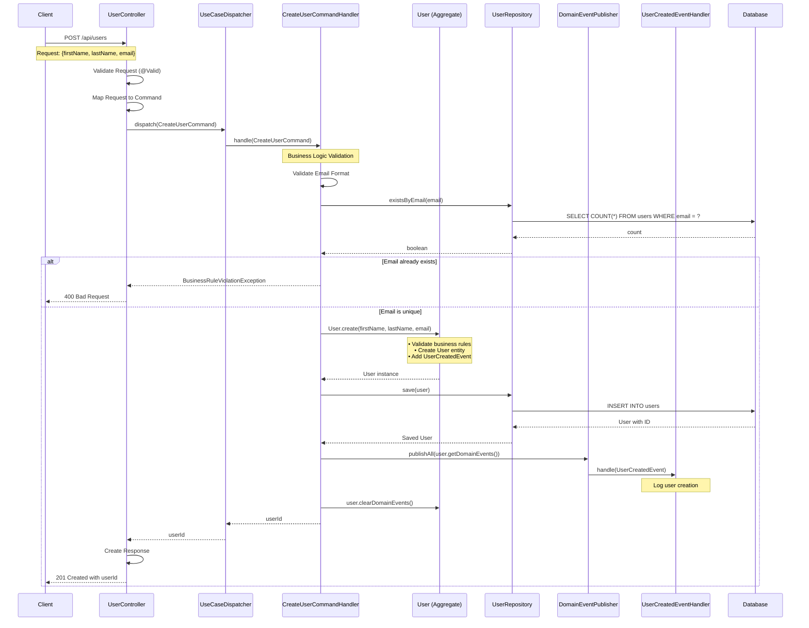
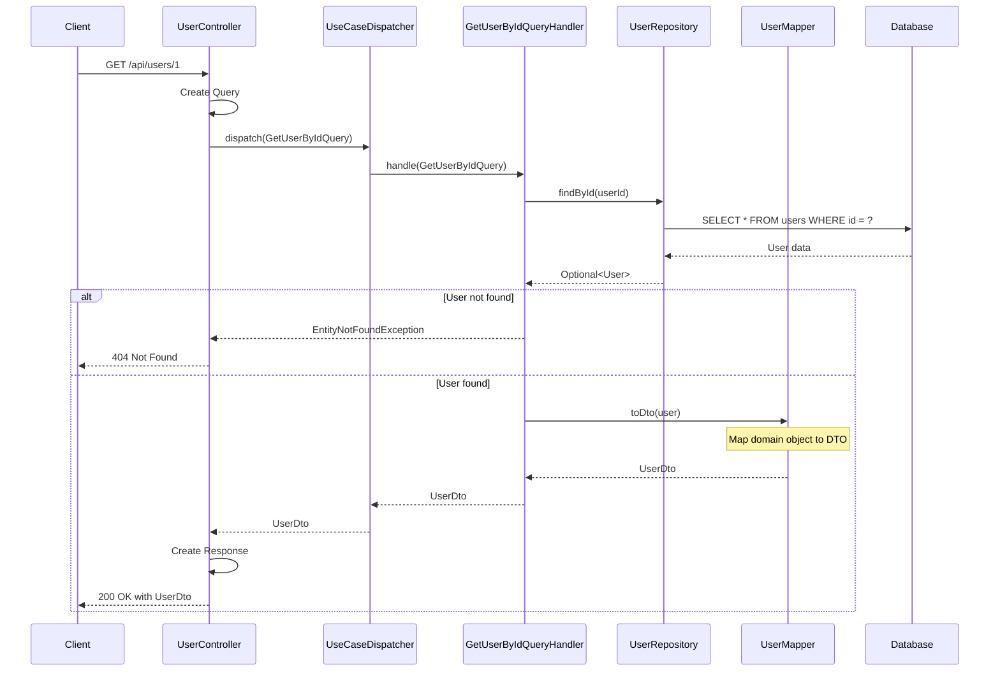
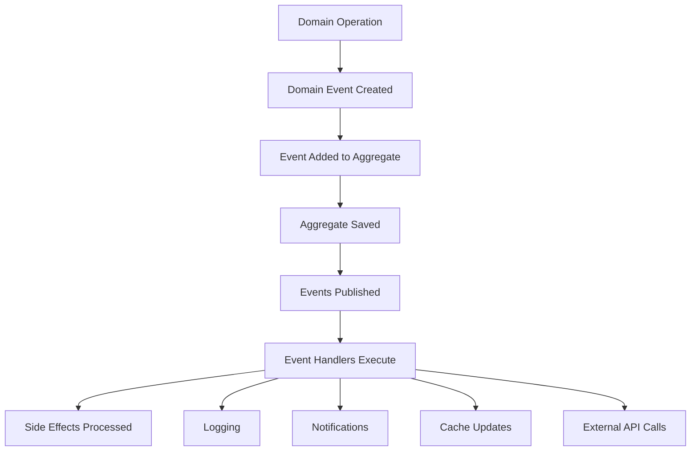
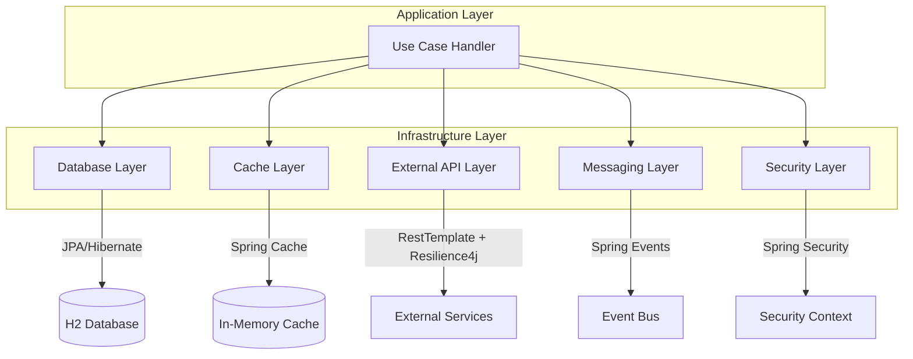
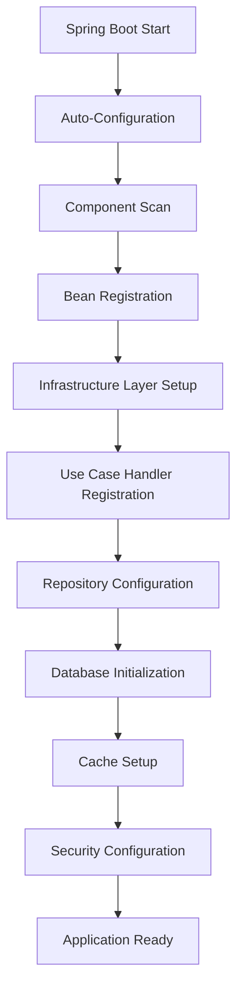

# Luồng Hoạt Động Của Ứng Dụng

## Tổng Quan

Tài liệu này mô tả luồng hoạt động của ứng dụng Spring Boot Clean Architecture Template, từ khi nhận HTTP request cho đến khi trả về response. Ứng dụng tuân theo các nguyên tắc Clean Architecture và triển khai pattern CQRS để tách biệt rõ ràng giữa Command (thay đổi dữ liệu) và Query (đọc dữ liệu).

## Kiến Trúc Tổng Quan

```
┌─────────────────┐    ┌─────────────────┐    ┌─────────────────┐    ┌─────────────────┐
│   Presentation  │ -> │   Application   │ -> │     Domain      │ -> │ Infrastructure  │
│     Layer       │    │     Layer       │    │     Layer       │    │     Layer       │
│                 │    │                 │    │                 │    │                 │
│ • Controllers   │    │ • Use Cases     │    │ • Entities      │    │ • Database      │
│ • DTOs          │    │ • Commands      │    │ • Value Objects │    │ • Cache         │
│ • Validation    │    │ • Queries       │    │ • Domain Events │    │ • External APIs │
│ • Exception     │    │ • Mappers       │    │ • Business Rules│    │ • Messaging     │
│   Handling      │    │ • Event Handlers│    │ • Repositories  │    │ • Security      │
└─────────────────┘    └─────────────────┘    └─────────────────┘    └─────────────────┘
```

## 1. Luồng Command (Tạo/Cập Nhật Dữ Liệu)

### 1.1 Tạo User Mới - POST /api/users



### 1.2 Chi Tiết Luồng Command

#### **Bước 1: Request Handling (Presentation Layer)**
```java
@PostMapping
public ResponseEntity<ApiResponse<CreateUserResponse>> createUser(
    @Valid @RequestBody CreateUserRequest request) {
    
    // 1. Spring Boot validation (@Valid) kiểm tra:
    //    - firstName: không rỗng, 2-50 ký tự
    //    - lastName: không rỗng, 2-50 ký tự  
    //    - email: định dạng email hợp lệ
    
    // 2. Map request thành command
    CreateUserCommand command = new CreateUserCommand();
    command.setFirstName(request.getFirstName());
    command.setLastName(request.getLastName());
    command.setEmail(request.getEmail());
    
    // 3. Dispatch command
    Long userId = useCaseDispatcher.dispatch(command);
    
    // 4. Tạo response
    CreateUserResponse response = new CreateUserResponse(userId);
    return ResponseEntity.status(HttpStatus.CREATED)
        .body(ApiResponse.success(response, "User created successfully"));
}
```

#### **Bước 2: Use Case Dispatching (Application Layer)**
```java
@Override
public <TResponse> TResponse dispatch(UseCase<TResponse> useCase) {
    // 1. Lấy class của use case
    Class<?> useCaseClass = useCase.getClass();
    
    // 2. Tìm handler tương ứng từ Spring Context
    UseCaseHandler<UseCase<TResponse>, TResponse> handler = 
        (UseCaseHandler<UseCase<TResponse>, TResponse>) handlers.get(useCaseClass);
        
    // 3. Thực thi handler
    return handler.handle(useCase);
}
```

#### **Bước 3: Business Logic (Application Layer)**
```java
@Override
@Transactional
public Long handle(CreateUserCommand command) {
    // 1. Validate business rules
    Email email = Email.of(command.getEmail());
    
    if (userRepository.existsByEmail(email)) {
        throw new BusinessRuleViolationException(
            "User with email " + email + " already exists");
    }
    
    // 2. Create domain object
    User user = User.create(
        command.getFirstName(),
        command.getLastName(),
        email
    );
    
    // 3. Persist to database
    User savedUser = userRepository.save(user);
    
    // 4. Publish domain events
    eventPublisher.publishAll(savedUser.getDomainEvents());
    savedUser.clearDomainEvents();
    
    return savedUser.getId();
}
```

#### **Bước 4: Domain Logic (Domain Layer)**
```java
// Factory method trong User aggregate
public static User create(String firstName, String lastName, Email email) {
    // 1. Tạo user instance với validation
    User user = new User(firstName, lastName, email);
    
    // 2. Thêm domain event
    user.addDomainEvent(new UserCreatedEvent(
        user.getFirstName(), 
        user.getLastName(), 
        email));
    
    return user;
}

// Constructor với business rules validation
private User(String firstName, String lastName, Email email) {
    this.firstName = validateAndTrimName(firstName, "First name");
    this.lastName = validateAndTrimName(lastName, "Last name");
    this.emailValue = email.getValue();
    this.createdAt = Instant.now();
    this.updatedAt = Instant.now();
}
```

## 2. Luồng Query (Đọc Dữ Liệu)

### 2.1 Lấy Thông Tin User - GET /api/users/{id}



### 2.2 Chi Tiết Luồng Query

#### **Bước 1: Request Handling (Presentation Layer)**
```java
@GetMapping("/{id}")
public ResponseEntity<ApiResponse<UserDto>> getUserById(@PathVariable Long id) {
    // 1. Tạo query object
    GetUserByIdQuery query = new GetUserByIdQuery(id);
    
    // 2. Dispatch query
    UserDto user = useCaseDispatcher.dispatch(query);
    
    // 3. Trả về response
    return ResponseEntity.ok(
        ApiResponse.success(user, "User retrieved successfully"));
}
```

#### **Bước 2: Query Handler (Application Layer)**
```java
@Override
@Transactional(readOnly = true)
public UserDto handle(GetUserByIdQuery query) {
    // 1. Tìm user trong database
    User user = userRepository.findById(query.getUserId())
        .orElseThrow(() -> new EntityNotFoundException("User", query.getUserId()));
    
    // 2. Map thành DTO
    return userMapper.toDto(user);
}
```

#### **Bước 3: Data Mapping (Application Layer)**
```java
// UserMapper sử dụng MapStruct để tự động generate code
@Mapping(source = "email.value", target = "email")
@Mapping(source = "createdAt", target = "createdAt", dateFormat = "yyyy-MM-dd'T'HH:mm:ss.SSS'Z'")
@Mapping(source = "updatedAt", target = "updatedAt", dateFormat = "yyyy-MM-dd'T'HH:mm:ss.SSS'Z'")
UserDto toDto(User user);
```

## 3. Luồng Event Processing

### 3.1 Domain Event Flow



#### **Event Handling Process**
```java
// 1. Event được tạo trong domain
user.addDomainEvent(new UserCreatedEvent(firstName, lastName, email));

// 2. Event được publish sau khi save
eventPublisher.publishAll(savedUser.getDomainEvents());

// 3. Event handler xử lý
@Component
public class UserCreatedEventHandler implements DomainEventHandler<UserCreatedEvent> {
    @Override
    public void handle(UserCreatedEvent event) {
        log.info("User created: {} {} with email {}", 
            event.getFirstName(), 
            event.getLastName(), 
            event.getEmail().getValue());
        
        // Có thể thêm các logic khác:
        // - Gửi email chào mừng
        // - Tạo user profile
        // - Log analytics
        // - Notify external systems
    }
}
```

## 4. Infrastructure Layer Integration

### 4.1 Multi-Layer Infrastructure Flow



### 4.2 Ví Dụ Integration Service

```java
@Service
public class UserIntegrationService {
    
    public User updateUserWithIntegration(User user) {
        // 1. Security check
        if (!securityAdapter.hasPermission("WRITE_USER")) {
            throw new SecurityException("Insufficient permissions");
        }
        
        // 2. Save to database
        User savedUser = userRepository.save(user);
        
        // 3. Update cache
        String cacheKey = "user:" + user.getId();
        cacheAdapter.put("users", cacheKey, savedUser);
        
        // 4. Notify external systems (with resilience)
        try {
            externalApiAdapter.post("notification-service", 
                "https://api.example.com/notify", notification);
        } catch (Exception e) {
            // Circuit breaker handles failures
            logger.warn("External notification failed: {}", e.getMessage());
        }
        
        // 5. Publish event
        messagingAdapter.publishMessage("user.events", 
            "User " + savedUser.getId() + " updated");
        
        return savedUser;
    }
}
```

## 5. Error Handling Flow

### 5.1 Exception Hierarchy

```
Exception
├── BusinessRuleViolationException (Domain)
├── EntityNotFoundException (Domain)  
├── ValidationException (Application)
└── InfrastructureException (Infrastructure)
    ├── DatabaseException
    ├── CacheException
    ├── ExternalApiException
    └── SecurityException
```

### 5.2 Global Exception Handling

```java
@RestControllerAdvice
public class GlobalExceptionHandler {
    
    @ExceptionHandler(BusinessRuleViolationException.class)
    public ResponseEntity<ApiResponse<Void>> handleBusinessRuleViolation(
        BusinessRuleViolationException ex) {
        return ResponseEntity.badRequest()
            .body(ApiResponse.error(ex.getMessage()));
    }
    
    @ExceptionHandler(EntityNotFoundException.class)
    public ResponseEntity<ApiResponse<Void>> handleEntityNotFound(
        EntityNotFoundException ex) {
        return ResponseEntity.notFound()
            .build();
    }
}
```

## 6. Configuration và Startup Flow

### 6.1 Application Startup Sequence



### 6.2 Key Configuration Classes

```java
// 1. Main Application Class
@SpringBootApplication
public class SpringBootTemplateApplication {
    public static void main(String[] args) {
        SpringApplication.run(SpringBootTemplateApplication.class, args);
    }
}

// 2. Use Case Configuration
@Configuration
@Import({DatabaseConfig.class, CacheConfig.class, ...})
public class UseCaseConfig {
    @Bean
    public Map<Class<?>, UseCaseHandler<?, ?>> useCaseHandlers(
        ApplicationContext context) {
        // Auto-register all use case handlers
    }
}

// 3. Database Configuration
@Configuration
@EnableJpaRepositories(basePackages = "com.example.demo.infrastructure.persistence")
public class JpaConfig {
    // JPA configuration
}
```

## 7. Monitoring và Observability

### 7.1 Application Endpoints

```yaml
# Actuator endpoints
management:
  endpoints:
    web:
      exposure:
        include: health,info,metrics
  endpoint:
    health:
      show-details: when-authorized

# API Documentation
springdoc:
  api-docs:
    path: /v3/api-docs
  swagger-ui:
    path: /swagger-ui.html
```

### 7.2 Available Endpoints

- **API Endpoints:**
  - `POST /api/users` - Tạo user mới
  - `GET /api/users/{id}` - Lấy thông tin user
  - `GET /api/users` - Lấy danh sách users

- **Management Endpoints:**
  - `GET /actuator/health` - Health check
  - `GET /actuator/info` - Application info
  - `GET /actuator/metrics` - Metrics

- **Documentation:**
  - `GET /swagger-ui.html` - API documentation
  - `GET /v3/api-docs` - OpenAPI spec
  - `GET /h2-console` - H2 database console

## 8. Performance Considerations

### 8.1 Transaction Management

- **Commands**: `@Transactional` (read-write)
- **Queries**: `@Transactional(readOnly = true)` (read-only)
- **Events**: Separate transactions để đảm bảo consistency

### 8.2 Caching Strategy

```java
// Cache adapter cho performance
@Service
public class CachedUserService {
    public Optional<User> getUser(Long id) {
        return cacheAdapter.get("users", "user:" + id, User.class)
            .or(() -> {
                Optional<User> user = userRepository.findById(id);
                user.ifPresent(u -> 
                    cacheAdapter.put("users", "user:" + id, u));
                return user;
            });
    }
}
```

### 8.3 Resilience Patterns

- **Circuit Breaker**: Cho external API calls
- **Retry**: Với exponential backoff
- **Timeout**: Để tránh long-running requests
- **Rate Limiting**: Bảo vệ resources

---

## Kết Luận

Ứng dụng này triển khai một kiến trúc sạch và có tổ chức tốt với:

1. **Separation of Concerns**: Mỗi layer có trách nhiệm riêng biệt
2. **CQRS Pattern**: Tách biệt command và query operations
3. **Domain-Driven Design**: Rich domain models với business logic
4. **Event-Driven Architecture**: Loose coupling thông qua domain events
5. **Infrastructure Abstraction**: Dễ dàng thay đổi implementation
6. **Comprehensive Error Handling**: Xử lý lỗi ở mọi layer
7. **Monitoring & Observability**: Theo dõi và debug dễ dàng

Luồng hoạt động này đảm bảo ứng dụng có thể scale, maintain và extend một cách hiệu quả.
