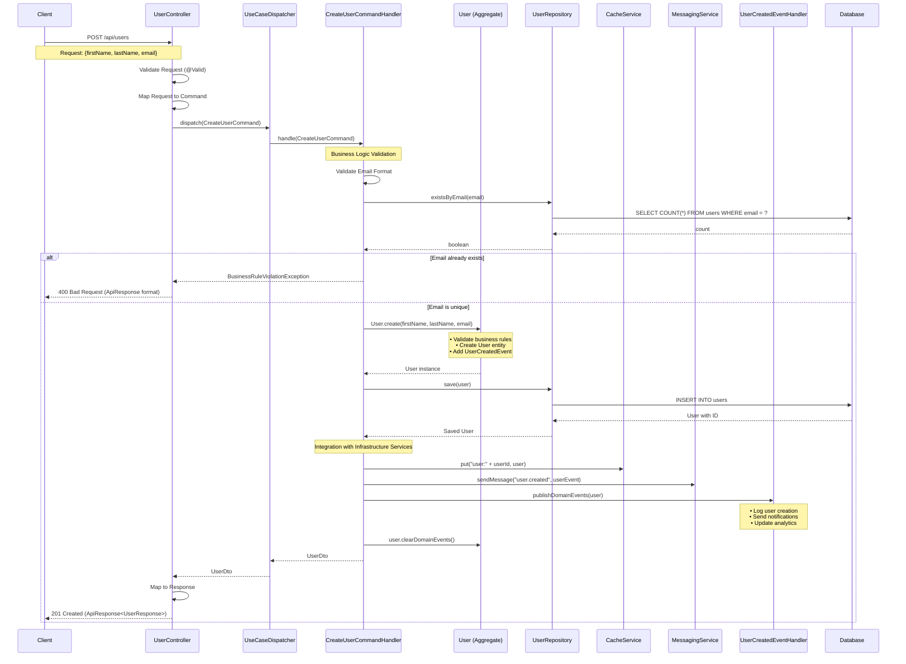
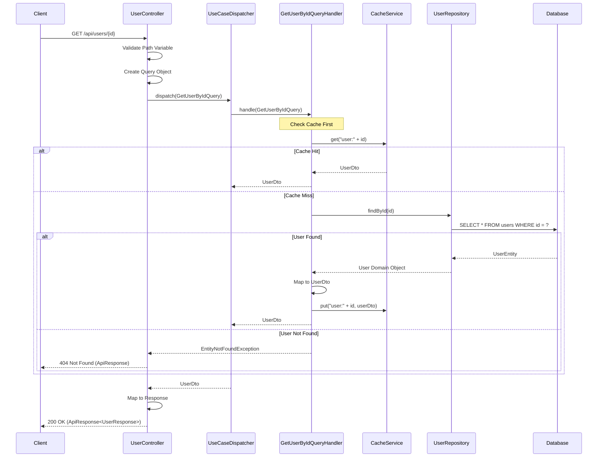
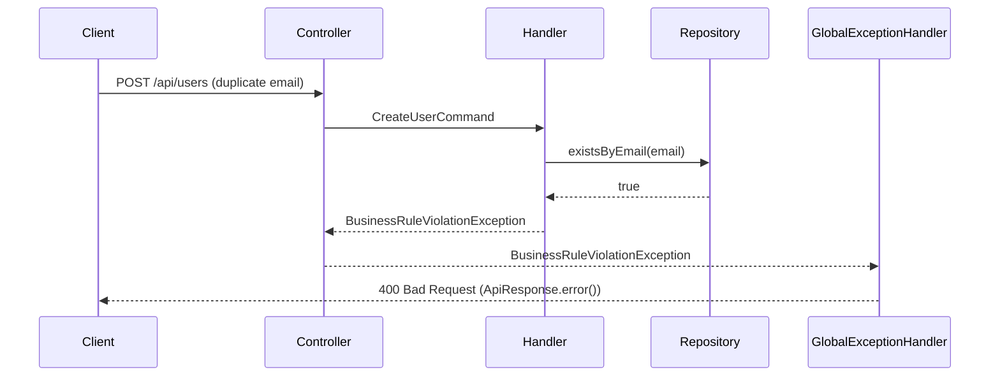
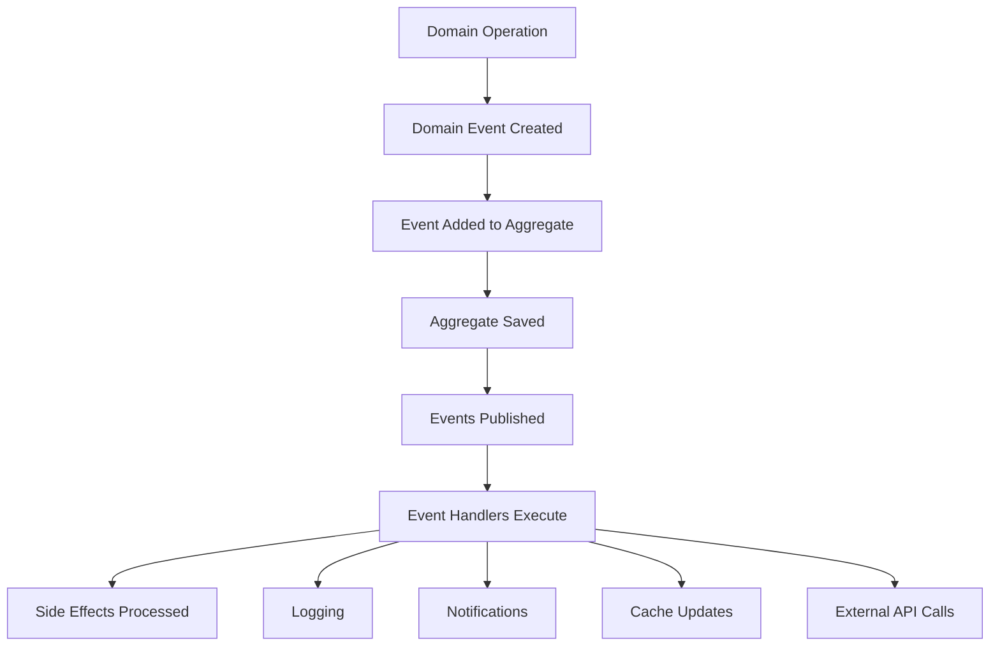
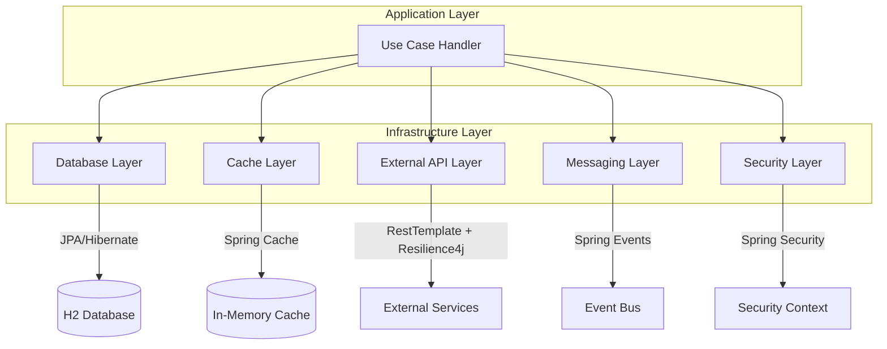
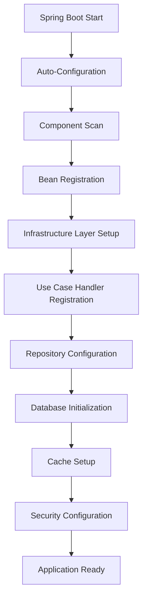

# Tài liệu Luồng xử lý ứng dụng

## 📋 Tổng quan

Tài liệu này mô tả luồng xử lý hoàn chình của Spring Boot Clean Architecture Template, từ việc nhận HTTP requests đến trả về responses. Ứng dụng tuân theo các nguyên tắc Clean Architecture và triển khai CQRS pattern để tách biệt rõ ràng Commands (sửa đổi dữ liệu) khỏi Queries (đọc dữ liệu).

## 🏗️ Tổng quan Kiến trúc

```
┌─────────────────┐    ┌─────────────────┐    ┌─────────────────┐    ┌─────────────────┐
│   Presentation  │ -> │   Application   │ -> │     Domain      │ -> │ Infrastructure  │
│     Layer       │    │     Layer       │    │     Layer       │    │     Layer       │
│                 │    │                 │    │                 │    │                 │
│ • Controllers   │    │ • Use Cases     │    │ • Entities      │    │ • Database      │
│ • DTOs          │    │ • Commands      │    │ • Value Objects │    │ • Cache         │
│ • Validation    │    │ • Queries       │    │ • Domain Events │    │ • External APIs │
│ • Exception     │    │ • Mappers       │    │ • Business Rules│    │ • Messaging     │
│   Handling      │    │ • Event Handlers│    │ • Repositories  │    │ • Security      │
└─────────────────┘    └─────────────────┘    └─────────────────┘    └─────────────────┘
```

## 🔄 Tích hợp Application Service

Ứng dụng sử dụng **Service Interface Pattern** để duy trì các nguyên tắc Clean Architecture:

```java
// Application Layer (Interfaces)
public interface CacheService {
    void put(String key, Object value);
    Optional<Object> get(String key);
}

public interface MessagingService {
    void sendMessage(String topic, Object message);
}

// Infrastructure Layer (Implementations)
@Service
public class CacheServiceImpl implements CacheService {
    // Redis/Caffeine implementation
}

@Service 
public class MessagingServiceImpl implements MessagingService {
    // RabbitMQ/Kafka implementation
}
```

## 1. 🚀 Luồng Command (Tạo/Cập nhật Dữ liệu)

### 1.1 Tạo User - POST /api/users



### 1.2 Luồng Command Chi tiết

#### **Bước 1: Xử lý Request (Presentation Layer)**
```java
@PostMapping
public ResponseEntity<ApiResponse<CreateUserResponse>> createUser(
    @Valid @RequestBody CreateUserRequest request) {
    
    // 1. Spring Boot validation (@Valid) checks:
    //    - firstName: not empty, 2-50 characters
    //    - lastName: not empty, 2-50 characters  
    //    - email: valid email format
    
    // 2. Map request to command
    CreateUserCommand command = CreateUserCommand.builder()
        .firstName(request.getFirstName())
        .lastName(request.getLastName())
        .email(request.getEmail())
        .build();
    
    // 3. Dispatch command
    UserDto userDto = useCaseDispatcher.dispatch(command);
    
    // 4. Create response using core ApiResponse
    CreateUserResponse response = UserMapper.toCreateResponse(userDto);
    return ResponseEntity.status(HttpStatus.CREATED)
        .body(ApiResponse.success(response, "User created successfully"));
}
```

#### **Bước 2: Use Case Dispatching (Application Layer)**
```java
@Override
public <TResponse> TResponse dispatch(UseCase<TResponse> useCase) {
    // 1. Get use case class
    Class<?> useCaseClass = useCase.getClass();
    
    // 2. Tìm handler tương ứng từ Spring Context
    UseCaseHandler<UseCase<TResponse>, TResponse> handler = 
        (UseCaseHandler<UseCase<TResponse>, TResponse>) handlers.get(useCaseClass);
        
    // 3. Thực thi handler
    return handler.handle(useCase);
}
```

#### **Bước 3: Business Logic (Application Layer)**
```java
@Override
@Transactional
public UserDto handle(CreateUserCommand command) {
    // 1. Validate business rules
    Email email = Email.of(command.getEmail());
    
    if (userRepository.existsByEmail(email)) {
        throw new BusinessRuleViolationException(
            "User with email " + email + " already exists");
    }
    
    // 2. Tạo domain object
    User user = User.create(
        command.getFirstName(),
        command.getLastName(),
        email
    );
    
    // 3. Lưu vào database
    User savedUser = userRepository.save(user);
    
    // 4. Tích hợp với infrastructure services
    cacheService.put("user:" + savedUser.getId(), savedUser);
    messagingService.sendMessage("user.created", 
        UserCreatedEvent.of(savedUser));
    
    // 5. Publish domain events
    eventPublisher.publishAll(savedUser.getDomainEvents());
    savedUser.clearDomainEvents();
    
    // 6. Trả về DTO
    return UserMapper.toDto(savedUser);
}
```

#### **Bước 4: Domain Logic (Domain Layer)**
```java
// Factory method in User aggregate
public static User create(String firstName, String lastName, Email email) {
    // 1. Create user instance with validation
    User user = new User(firstName, lastName, email);
    
    // 2. Add domain event
    user.addDomainEvent(new UserCreatedEvent(
        user.getId(),
        user.getFirstName(), 
        user.getLastName(), 
        email));
    
    return user;
}

// Email value object validation
public class Email {
    private final String value;
    
    public static Email of(String value) {
        if (StringUtils.isBlank(value)) {
            throw new BusinessRuleViolationException("Email cannot be blank");
        }
        if (!isValidEmailFormat(value)) {
            throw new BusinessRuleViolationException("Invalid email format");
        }
        return new Email(value.trim().toLowerCase());
    }
}
```

## 2. 🔍 Query Flow (Read Data)

### 2.1 Get User Information - GET /api/users/{id}



### 2.2 Luồng Query Chi tiết

#### **Bước 1: Xử lý Request**
```java
@GetMapping("/{id}")
public ResponseEntity<ApiResponse<UserResponse>> getUserById(@PathVariable Long id) {
    // 1. Validate path variable (Spring thực hiện basic validation)
    if (id <= 0) {
        throw new ValidationException("User ID must be positive");
    }
    
    // 2. Tạo query object
    GetUserByIdQuery query = new GetUserByIdQuery(id);
    
    // 3. Dispatch query
    UserDto userDto = useCaseDispatcher.dispatch(query);
    
    // 4. Map sang response sử dụng core utilities
    UserResponse response = UserMapper.toResponse(userDto);
    return ResponseEntity.ok(
        ApiResponse.success(response, "User retrieved successfully"));
}
```

#### **Bước 2: Query Handler với Caching**
```java
@Override
@Transactional(readOnly = true)
public UserDto handle(GetUserByIdQuery query) {
    Long userId = query.getUserId();
    
    // 1. Thử cache trước (tối ưu hóa performance)
    Optional<Object> cached = cacheService.get("user:" + userId);
    if (cached.isPresent()) {
        return (UserDto) cached.get();
    }
    
    // 2. Fallback sang database
    User user = userRepository.findById(userId)
        .orElseThrow(() -> new EntityNotFoundException(
            "User not found with ID: " + userId));
    
    // 3. Map sang DTO
    UserDto userDto = UserMapper.toDto(user);
    
    // 4. Cache cho các requests tương lai
    cacheService.put("user:" + userId, userDto);
    
    return userDto;
}
```

## 3. 🚨 Luồng xử lý Exception

### 3.1 Global Exception Handler (Core Component)

```java
@RestControllerAdvice
public class GlobalExceptionHandler {
    
    @ExceptionHandler(BusinessRuleViolationException.class)
    public ResponseEntity<ApiResponse<Void>> handleBusinessRuleViolation(
            BusinessRuleViolationException ex) {
        
        return ResponseEntity.badRequest()
            .body(ApiResponse.error("BUSINESS_RULE_VIOLATION", ex.getMessage()));
    }
    
    @ExceptionHandler(EntityNotFoundException.class)
    public ResponseEntity<ApiResponse<Void>> handleEntityNotFound(
            EntityNotFoundException ex) {
        
        return ResponseEntity.status(HttpStatus.NOT_FOUND)
            .body(ApiResponse.error("ENTITY_NOT_FOUND", ex.getMessage()));
    }
    
    @ExceptionHandler(ValidationException.class)
    public ResponseEntity<ApiResponse<Void>> handleValidation(
            ValidationException ex) {
        
        return ResponseEntity.badRequest()
            .body(ApiResponse.error("VALIDATION_ERROR", ex.getMessage()));
    }
}
```

### 3.2 Ví dụ Exception Flow



## 4. 📅 Luồng xử lý Event

### 4.1 Luồng Domain Event



#### **Quy trình xử lý Event**
```java
// 1. Event được tạo trong domain
user.addDomainEvent(new UserCreatedEvent(firstName, lastName, email));

// 2. Event được publish sau khi save
eventPublisher.publishAll(savedUser.getDomainEvents());

// 3. Event handler xử lý
@Component
public class UserCreatedEventHandler implements DomainEventHandler<UserCreatedEvent> {
    @Override
    public void handle(UserCreatedEvent event) {
        log.info("User created: {} {} with email {}", 
            event.getFirstName(), 
            event.getLastName(), 
            event.getEmail().getValue());
        
        // Có thể thêm các logic khác:
        // - Gửi email chào mừng
        // - Tạo user profile
        // - Log analytics
        // - Notify external systems
    }
}
```

## 4. Tích hợp Infrastructure Layer

### 4.1 Multi-Layer Infrastructure Flow



### 4.2 Ví Dụ Integration Service

```java
@Service
public class UserIntegrationService {
    
    public User updateUserWithIntegration(User user) {
        // 1. Security check
        if (!securityAdapter.hasPermission("WRITE_USER")) {
            throw new SecurityException("Insufficient permissions");
        }
        
        // 2. Save to database
        User savedUser = userRepository.save(user);
        
        // 3. Update cache
        String cacheKey = "user:" + user.getId();
        cacheAdapter.put("users", cacheKey, savedUser);
        
        // 4. Notify external systems (with resilience)
        try {
            externalApiAdapter.post("notification-service", 
                "https://api.example.com/notify", notification);
        } catch (Exception e) {
            // Circuit breaker handles failures
            logger.warn("External notification failed: {}", e.getMessage());
        }
        
        // 5. Publish event
        messagingAdapter.publishMessage("user.events", 
            "User " + savedUser.getId() + " updated");
        
        return savedUser;
    }
}
```

## 5. Error Handling Flow

### 5.1 Exception Hierarchy

```
Exception
├── BusinessRuleViolationException (Domain)
├── EntityNotFoundException (Domain)  
├── ValidationException (Application)
└── InfrastructureException (Infrastructure)
    ├── DatabaseException
    ├── CacheException
    ├── ExternalApiException
    └── SecurityException
```

### 5.2 Global Exception Handling

```java
@RestControllerAdvice
public class GlobalExceptionHandler {
    
    @ExceptionHandler(BusinessRuleViolationException.class)
    public ResponseEntity<ApiResponse<Void>> handleBusinessRuleViolation(
        BusinessRuleViolationException ex) {
        return ResponseEntity.badRequest()
            .body(ApiResponse.error(ex.getMessage()));
    }
    
    @ExceptionHandler(EntityNotFoundException.class)
    public ResponseEntity<ApiResponse<Void>> handleEntityNotFound(
        EntityNotFoundException ex) {
        return ResponseEntity.notFound()
            .build();
    }
}
```

## 6. Configuration và Startup Flow

### 6.1 Application Startup Sequence



### 6.2 Key Configuration Classes

```java
// 1. Main Application Class
@SpringBootApplication
public class SpringBootTemplateApplication {
    public static void main(String[] args) {
        SpringApplication.run(SpringBootTemplateApplication.class, args);
    }
}

// 2. Use Case Configuration
@Configuration
@Import({DatabaseConfig.class, CacheConfig.class, ...})
public class UseCaseConfig {
    @Bean
    public Map<Class<?>, UseCaseHandler<?, ?>> useCaseHandlers(
        ApplicationContext context) {
        // Auto-register all use case handlers
    }
}

// 3. Database Configuration
@Configuration
@EnableJpaRepositories(basePackages = "com.example.demo.infrastructure.persistence")
public class JpaConfig {
    // JPA configuration
}
```

## 7. Monitoring và Observability

### 7.1 Application Endpoints

```yaml
# Actuator endpoints
management:
  endpoints:
    web:
      exposure:
        include: health,info,metrics
  endpoint:
    health:
      show-details: when-authorized

# API Documentation
springdoc:
  api-docs:
    path: /v3/api-docs
  swagger-ui:
    path: /swagger-ui.html
```

### 7.2 Các Endpoints có sẵn

- **API Endpoints:**
  - `POST /api/users` - Tạo user mới
  - `GET /api/users/{id}` - Lấy thông tin user
  - `GET /api/users` - Lấy danh sách users

- **Management Endpoints:**
  - `GET /actuator/health` - Health check
  - `GET /actuator/info` - Application info
  - `GET /actuator/metrics` - Metrics

- **Documentation:**
  - `GET /swagger-ui.html` - API documentation
  - `GET /v3/api-docs` - OpenAPI spec
  - `GET /h2-console` - H2 database console

## 8. Cân nhắc về Performance

### 8.1 Quản lý Transaction

- **Commands**: `@Transactional` (read-write)
- **Queries**: `@Transactional(readOnly = true)` (read-only)
- **Events**: Separate transactions để đảm bảo consistency

### 8.2 Chiến lược Caching

```java
// Cache adapter cho performance
@Service
public class CachedUserService {
    public Optional<User> getUser(Long id) {
        return cacheAdapter.get("users", "user:" + id, User.class)
            .or(() -> {
                Optional<User> user = userRepository.findById(id);
                user.ifPresent(u -> 
                    cacheAdapter.put("users", "user:" + id, u));
                return user;
            });
    }
}
```

### 8.3 Resilience Patterns

- **Circuit Breaker**: Cho external API calls
- **Retry**: Với exponential backoff
- **Timeout**: Để tránh long-running requests
- **Rate Limiting**: Bảo vệ resources

---

## Kết Luận

Ứng dụng này triển khai một kiến trúc sạch và có tổ chức tốt với:

1. **Separation of Concerns**: Mỗi layer có trách nhiệm riêng biệt
2. **CQRS Pattern**: Tách biệt command và query operations
3. **Domain-Driven Design**: Rich domain models với business logic
4. **Event-Driven Architecture**: Loose coupling thông qua domain events
5. **Infrastructure Abstraction**: Dễ dàng thay đổi implementation
6. **Comprehensive Error Handling**: Xử lý lỗi ở mọi layer
7. **Monitoring & Observability**: Theo dõi và debug dễ dàng

Luồng hoạt động này đảm bảo ứng dụng có thể scale, maintain và extend một cách hiệu quả.
